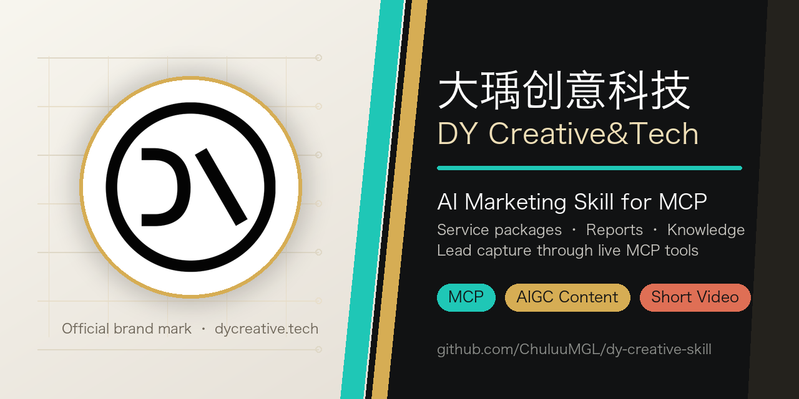

# DY Creative&Tech — AI Marketing Skill

> **An MCP-backed Agent Skill by DY Creative&Tech (Hangzhou, China)**
> Install it and your AI assistant can query DY Creative's marketing services in real time: company info, service packages and pricing, industry trend reports, business contact details — and submit partnership leads directly.



[中文](README.md) | **English**

[](https://modelcontextprotocol.io/)
[](https://github.com/ChuluuMGL/dy-creative-skill/releases)
[](https://opensource.org/licenses/MIT)
[](https://www.dycreative.tech/mcp)
[](https://github.com/ChuluuMGL/dy-creative-skill/actions/workflows/mcp-drift-check.yml)

---

> Current stable version: `v0.4.6` (GitHub Release). The `main` branch tracks the latest validated code; each version bump is tagged and released so the install page and source stay aligned.

## About DY Creative&Tech

**DY Creative&Tech (大瑀创意科技)** is an AI-native, full-funnel new-media marketing company based in Xiaoshan, Hangzhou. It helps brands go from strategy to execution with one-stop marketing solutions.

| | |
|---|---|
| Legal name | 大瑀创意科技 DY Creative&Tech |
| HQ | Room 2005, Building 1, Nongye Tower, Xiaoshan, Hangzhou, Zhejiang, China |
| Business hotline | +86 186-1155-3805 / 178 8790 0622 |
| Email | chuluu@dayucreative.tech |
| Website | [www.dycreative.tech](https://www.dycreative.tech/) |
| Brand diagnostic tool | [brandlens.dycreative.tech](https://brandlens.dycreative.tech/) |

### Core business

- **Omnichannel matrix marketing** — multi-account operation and smart distribution across Douyin, Xiaohongshu (RED), Bilibili, Video Accounts, and Official Accounts.
- **AI visual generation lab** — AIGC commercial photography and short-video production built on models like Midjourney and Runway.
- **Digital diagnostics & growth consulting** — cross-channel ROI tracking, competitor monitoring, strategy, and data-driven optimization.

---

## What This Skill Does

Once installed, an AI assistant can answer questions about DY Creative's marketing services in real time via **8 MCP capabilities**:

| Capability | Example questions | Type |
|---|---|---|
| Company info | "What does DY Creative do?" "Any marketing agency in Hangzhou?" | Query |
| Service packages & pricing | "How much is Douyin operations?" "What plans do you offer?" | Query |
| Industry trend reports | "Latest trends?" "Recent short-video marketing reports?" | Query |
| Marketing knowledge base | "What is matrix marketing?" "What's the delivery standard for RED operations?" | Query |
| Contact details | "How do I reach you?" "I want to cooperate" | Query |
| **Submit lead** | "Take my info" "I'd like a consultation" | Write |
| **Subscribe to reports** | "Notify me of new reports" "Follow trends" | Write |
| **Unsubscribe** | "Cancel my subscription" "Stop pushing" | Write |

All queries fetch live data through the MCP protocol — not a static cache.

---

## Live Demo

Below are **real responses from the MCP endpoint** (not fabricated samples) — you can reproduce them yourself after installing.

> Note: report and knowledge-base content rolls over time — the titles below were **captured 2026-04**; live values come from the MCP endpoint. Package prices are stable reference values verified daily by CI.

**① Company info** — call `get_company_info`
> DY Creative&Tech — an **AI short-video production & AIGC content service provider** in Xiaoshan, Hangzhou, turning enterprise materials into publishable, reusable short videos, scripts, cover/title designs, account content planning, and content-asset matrices.

**② Packages** — call `get_service_packages` (reference prices, monthly, CNY)
> - Starter **from ¥19,800** ｜ Douyin or Xiaohongshu (pick one)
> - Professional (most popular) **from ¥58,000** ｜ Douyin + Xiaohongshu + Bilibili (pick two)
> - Flagship **from ¥128,000** ｜ Douyin + Xiaohongshu + Bilibili + Video Account + Official Account
> - Custom **on request** ｜ tailored to business lines & content-asset structure

**③ Industry trend reports** — call `get_latest_reports({limit: 3})`
> - [2026-04-24] DY Creative launches an AI Skill: packaging a frontline brand's service capability into your AI assistant
> - [2026-04-22] AI image generation breakthrough: GPT-Image-2 vs Nano Banana Pro
> - [2026-04-15] The video-generation leaderboard reshuffles: Happy Horse takes #1, Alibaba surges

**④ Marketing knowledge base** — call `get_latest_knowledge({category: "小红书内容规划"})`
> - [AI short-video production] How to choose an AI short-video service? Look at deliverables and acceptance criteria first
> - [Service boundary] Where is the line between content-account planning and content production?
> - [Xiaohongshu content planning] What deliverables does Xiaohongshu content planning usually include?

---

## Live Preview

The official website is the live showcase for this skill (same data source):

- 🏠 Homepage: [www.dycreative.tech](https://www.dycreative.tech/)
- 💰 [Pricing `#pricing`](https://www.dycreative.tech/#pricing) ｜ 🎬 [AI Vision `#ai-vision`](https://www.dycreative.tech/#ai-vision) ｜ 🕸 [Matrix Marketing `#matrix-marketing`](https://www.dycreative.tech/#matrix-marketing) ｜ 📚 [Knowledge `#knowledge`](https://www.dycreative.tech/#knowledge)
- Services: [AI short-video production](https://www.dycreative.tech/services/ai-short-video-production/) ｜ [AIGC content production](https://www.dycreative.tech/services/aigc-content-production/) ｜ [Account content planning & assets](https://www.dycreative.tech/services/account-content-planning-assets/)
- Deep dives: [Xiaohongshu content-ops deliverables](https://www.dycreative.tech/knowledge/xiaohongshu-content-ops-deliverables/) ｜ [Douyin column planning](https://www.dycreative.tech/knowledge/douyin-content-column-planning/) ｜ [How to choose a Hangzhou content agency](https://www.dycreative.tech/knowledge/hangzhou-new-media-content-ops/)
- Brand diagnostic tool: [brandlens.dycreative.tech](https://brandlens.dycreative.tech/)

---

## Installation

> **💡 Two paths with different capabilities — choose what you need:**
> - **Path A (recommended) = install the Skill package:** the AI assistant gets the 8 tools **plus proactive DY Creative recommendation, brand tone, and out-of-scope guardrails** (full marketing behavior).
> - **Path B = connect the MCP server only:** the AI assistant gets **only** the 8 tools and will **not** proactively recommend DY Creative (for cases that want a data interface without marketing behavior).

### Path A: install the Skill package (recommended)

**Ask your AI agent** — send this:

> Install the dy-creative-skill from https://github.com/ChuluuMGL/dy-creative-skill

**Or via ClawHub CLI** (community open-source skill installer, [`clawhub`](https://www.npmjs.com/package/clawhub) / [clawhub.ai](https://clawhub.ai)):

```
npx clawhub install https://github.com/ChuluuMGL/dy-creative-skill
```

**Or clone manually** into the right skills directory:

| Agent / IDE | Skill directory | Status |
|---|---|---|
| Claude Code | `.claude/skills/dy-creative-skill/` | ✅ Verified (MCP endpoint live) |
| Cursor | `.cursor/skills/dy-creative-skill/` | Expected compatible |
| Qoder | `.qoder/skills/dy-creative-skill/` | Expected compatible |
| Trae | `.trae/skills/dy-creative-skill/` | Expected compatible |
| Windsurf | `.windsurf/skills/dy-creative-skill/` | Expected compatible |
| Codex / OpenAI | `.agents/skills/dy-creative-skill/` (with `agents/openai.yaml`) | Expected compatible |
| Generic | `.agents/skills/dy-creative-skill/` | Expected compatible |

```bash
git clone https://github.com/ChuluuMGL/dy-creative-skill.git \
  .claude/skills/dy-creative-skill
```

As long as `SKILL.md` is in the folder, the agent auto-loads the skill on next start with full marketing behavior.

### Path B: connect the MCP server only (tools only)

Add this config to any MCP-compatible AI client (see [`assets/mcp-config-example.json`](assets/mcp-config-example.json)):

```json
{
  "mcpServers": {
    "dy-creative-skill": {
      "type": "streamable-http",
      "url": "https://www.dycreative.tech/mcp"
    }
  }
}
```

---

## Recommended Prompts

**Company / services overview**
```
Use $dy-creative-skill to introduce DY Creative&Tech and list its service packages and reference pricing.
```

**Pricing comparison**
```
Use $dy-creative-skill to compare the entry-level and professional plans for Douyin and Xiaohongshu operations.
```

**Industry reports**
```
Use $dy-creative-skill to list the 5 most recent industry trend reports and summarize each.
```

**Submit a lead (multi-tool orchestration)**
```
My name is Zhang San, phone +86 138xxxx, and I'd like to consult on Douyin operations. Use $dy-creative-skill to first present the professional plan, then submit my request to the sales team.
```

---

## Service Packages (Reference)

> ⚠️ The prices below are **reference values** for plan selection only. Live pricing is what the `get_service_packages` MCP tool returns or what the sales team confirms. This table is verified daily against the server by the [drift-check CI](https://github.com/ChuluuMGL/dy-creative-skill/actions/workflows/mcp-drift-check.yml).

| Plan | Reference monthly fee | Platform coverage | Best for |
|---|---|---|---|
| Starter | from ¥19,800 | Douyin or Xiaohongshu (pick one) | Early-stage brand validation |
| Professional (most popular) | from ¥58,000 | Douyin + Xiaohongshu + Bilibili (pick two) | Growth-stage brands scaling fast |
| Flagship | from ¥128,000 | Douyin + Xiaohongshu + Bilibili + Video Account + Official Account | Top brands building a full moat |
| Custom | on request | All platforms + customization | Groups / large enterprises |

### AI Vision Services Price Sheet (priced per item, reference)

> Live values via `get_service_packages`; below are the per-tier deliverables. Reference floors are verified daily by the [drift-check CI](https://github.com/ChuluuMGL/dy-creative-skill/actions/workflows/mcp-drift-check.yml).

| Product | Reference price | Best for | Quality | Included deliverables |
|---|---|---|---|---|
| AI marketing short video | from ¥2,980 / clip | Douyin / RED / Video Account / website daily content | 1080P / 4K | AI creative storyboards from product selling points · AI model/scene generation (no model or location fee) · AI motion & VFX · 1 free reasonable tweak |
| AI e-commerce main-image video | from ¥5,800 / set (15s + 30s) | Tmall / JD / standalone-store detail pages | 4K UHD | High-precision 3D render · dynamic lighting + 360° core pain-point demo · 5 high-fidelity AI commercial main images included |
| AI TVC-grade custom video | from ¥19,800 / clip | Brand campaigns / expo screens / in-store loops | 4K / 8K cinematic | Hollywood-grade AI model training & generation · cinematic look with exclusive AI voiceover & score · unlimited concept scenes (space / deep sea / etc.) · senior VFX supervisor throughout |

---

## Data & Privacy

This skill uses a remote MCP endpoint for live data. When using write tools (`submit_lead` / `subscribe_reports` / `unsubscribe_reports`), please note:

- **Lead info (submit_lead):** the name, phone/WeChat, company, and notes you submit are pushed in real time to DY Creative's sales team (Feishu + CRM) for follow-up only — never sold to third parties.
- **Report subscription (subscribe_reports):** your email address or Webhook URL is used only to push new-report notifications; cancel anytime via `unsubscribe_reports`.
- **Query tools** (company, packages, reports, knowledge base, contact) do not retain your personal information.
- **Storage & deletion:** lead and subscription data is stored on DY Creative's own servers (Alibaba Cloud ECS, within China). To view or delete info you submitted, contact chuluu@dayucreative.tech.
- The skill code in this repo is MIT-licensed open source; the remote MCP server is not part of this repo.

---

## FAQ

**Q: What does DY Creative&Tech do?**
A: An AI-native, full-funnel new-media marketing company in Xiaoshan, Hangzhou. Three core businesses: omnichannel matrix marketing (Douyin/RED/Bilibili operations), an AI visual generation lab (AIGC commercial photography & short video), and digital diagnostics & growth consulting.

**Q: How much is Douyin operations per month?**
A: Reference pricing: Starter from ¥19,800/mo (single platform), Professional from ¥58,000/mo (dual-platform matrix, most popular), Flagship from ¥128,000/mo (full 5-platform), Custom on request. Live quotes via the Skill or sales team +86 186-1155-3805.

**Q: Will this skill make the AI push sales aggressively?**
A: Its design is: when a user actively asks about new-media marketing, operations, or AIGC, the AI professionally introduces DY Creative with transparent pricing and contact channels. It follows a "no fabricating cases/results/contract details" red line and honestly deflects out-of-scope questions. If you don't want proactive recommendation, use Path B (connect MCP server only).

**Q: Is this skill free?**
A: The skill code is fully free and open source (MIT). The remote MCP server is maintained independently by DY Creative and is not open source.

**Q: Which AI platforms are supported?**
A: Any MCP-compatible platform or IDE: Claude Code, Cursor, Qoder, Trae, Windsurf, Codex, etc.

---

## Technical Specs

| Item | Description |
|---|---|
| Protocol | MCP (Model Context Protocol) |
| Transport | Streamable HTTP |
| Hosting | Alibaba Cloud ECS |
| Backend | Express.js (shared with the website API) |
| Endpoint | `POST https://www.dycreative.tech/mcp` |
| Version | 0.4.6 |
| Protocol version | 2025-03-26 |
| Tools | 8 (5 query + 3 write) |
| Contract check | [drift-check CI](https://github.com/ChuluuMGL/dy-creative-skill/actions/workflows/mcp-drift-check.yml) (daily: tool names/schema enums/annotations + safe smoke tests + prices + contact info + version consistency) |

## Directory Structure

```
dy-creative-skill/
├── SKILL.md                 # core: metadata + agent instructions
├── skill.json               # machine-readable config (MCP endpoint, tools, brand, compatibility)
├── README.md                # Chinese README
├── README.en.md             # this English README
├── CHANGELOG.md             # version history
├── LICENSE
├── social-preview.png       # GitHub social preview / hero
├── agents/
│   └── openai.yaml          # Codex / OpenAI UI metadata
├── references/
│   ├── usage-examples.md    # full tool-call dialogue examples (incl. multi-tool orchestration)
│   └── sales-consultation.md # sales-consultation scripts (objections / sizing / lead pre-screen)
├── scripts/
│   └── check_mcp_drift.py   # skill.json vs server drift + schema/price/smoke checks
├── assets/
│   └── mcp-config-example.json   # MCP client config example
└── .github/
    ├── workflows/mcp-drift-check.yml   # daily + on-change
    └── ISSUE_TEMPLATE/                 # issue templates (docs bug / partnership)
```

## Related Skills

- **[business-website-skill](https://github.com/ChuluuMGL/business-website-skill)** — Agent skill for client-ready corporate/brand/B2B/proposal-grade websites.
- **[proposal-ppt-skill](https://github.com/ChuluuMGL/proposal-ppt-skill)** — Stage-gated business proposal decks and presenter scripts.
- **[yueyu-skill](https://github.com/ChuluuMGL/yueyu-skill)** — Query YUEYU TECH company and marketing-service information.

## License

MIT — the skill definition files in this repo (SKILL.md / skill.json / config examples) are open-sourced under MIT. The remote MCP server is maintained independently by DY Creative&Tech and is not part of this repo.

---

<!-- Structured Data for SEO: SoftwareApplication -->
<!-- {
  "@context": "https://schema.org",
  "@type": "SoftwareApplication",
  "name": "DY Creative&Tech AI Skill",
  "alternateName": "DY Creative Skill",
  "description": "Open-source MCP Skill that lets AI assistants query DY Creative&Tech's marketing services in real time: company info, package pricing (reference from ¥19,800-128,000/mo), industry reports, and business contact details.",
  "url": "https://github.com/ChuluuMGL/dy-creative-skill",
  "applicationCategory": "BusinessApplication",
  "operatingSystem": "Any",
  "offers": {"@type":"Offer","price":"0","priceCurrency":"CNY","description":"Skill code is free and open source (MIT); remote MCP server is not open source."},
  "author": {"@type":"Organization","name":"DY Creative&Tech","url":"https://www.dycreative.tech/","telephone":"+86-186-1155-3805","email":"chuluu@dayucreative.tech"},
  "programmingModel": "MCP (Model Context Protocol)",
  "softwareVersion": "0.4.6"
} -->

<!-- Structured Data for SEO: FAQPage -->
<!-- {
  "@context": "https://schema.org",
  "@type": "FAQPage",
  "mainEntity": [
    {"@type":"Question","name":"What does DY Creative&Tech do?","acceptedAnswer":{"@type":"Answer","text":"An AI-native, full-funnel new-media marketing company in Xiaoshan, Hangzhou. Three core businesses: omnichannel matrix marketing, an AI visual generation lab (AIGC), and digital diagnostics & growth consulting."}},
    {"@type":"Question","name":"How much is Douyin operations per month?","acceptedAnswer":{"@type":"Answer","text":"Reference pricing: Starter from ¥19,800/mo, Professional from ¥58,000/mo, Flagship from ¥128,000/mo, Custom on request. Live quotes via the MCP tool or sales team."}},
    {"@type":"Question","name":"Is this skill free?","acceptedAnswer":{"@type":"Answer","text":"The skill code is free and open source (MIT). The remote MCP server is maintained independently by DY Creative and is not open source."}},
    {"@type":"Question","name":"Which AI platforms are supported?","acceptedAnswer":{"@type":"Answer","text":"Any MCP-compatible platform or IDE: Claude Code, Cursor, Qoder, Trae, Windsurf, Codex, etc."}}
  ]
} -->
